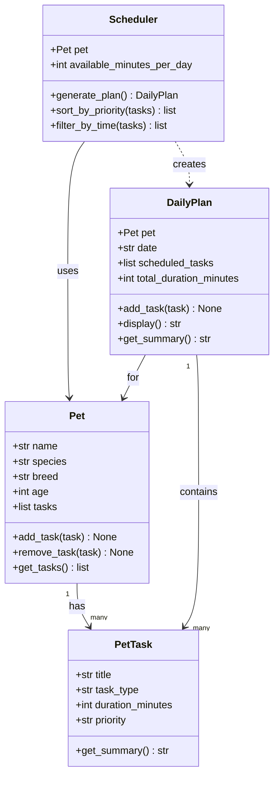

# PawPal+ — 4-Class Design Reference

## Final Class Set

### V1 Core (implement now)

| Class | Role |
|---|---|
| `Pet` | The entity being cared for; holds all its tasks |
| `PetTask` | A single care task with duration and priority (stored as plain strings) |
| `Scheduler` | Scheduling logic: sorts by priority, filters by time, produces a `DailyPlan` |
| `DailyPlan` | The output: ordered list of tasks that fit within the time budget |

### Deferred (add when scaling)

| Class | When to add |
|---|---|
| `Owner` | When supporting multiple owners. For now, `available_minutes_per_day` lives directly on `Scheduler`. |
| `Priority` (enum) | When you need strict validation. String `"low"/"medium"/"high"` + a sort dict is sufficient for v1. |
| `TaskType` (enum) | When you need to filter/validate by category. String `"walk"/"feed"/etc.` on `PetTask` is fine for v1. |

---

## UML Diagram



---

## Class Details

### `Pet`
- Holds the pet's basic info and owns a list of `PetTask` objects
- `add_task` / `remove_task` / `get_tasks` manage the task list

### `PetTask`
- `title`: human-readable name (e.g. `"Morning walk"`)
- `task_type`: plain string — `"walk"`, `"feed"`, `"medication"`, `"grooming"`, `"enrichment"`, `"other"`
- `duration_minutes`: how long the task takes
- `priority`: plain string — `"low"`, `"medium"`, or `"high"`
- `get_summary()`: returns a one-line description, e.g. `"Morning walk — 30 min [high]"`

### `Scheduler`
- Holds the `Pet` and the daily time budget (`available_minutes_per_day`)
- `generate_plan()` — main entry point; returns a `DailyPlan`
- `sort_by_priority(tasks)` — sorts tasks high → low using the lookup dict below
- `filter_by_time(tasks)` — greedily includes tasks until the time budget is exhausted

Priority sort pattern (no enum needed):
```python
PRIORITY_ORDER = {"low": 0, "medium": 1, "high": 2}

def sort_by_priority(self, tasks):
    return sorted(tasks, key=lambda t: PRIORITY_ORDER[t.priority], reverse=True)
```

### `DailyPlan`
- Holds the `Pet` it was generated for, the date, and the list of `PetTask` objects that fit
- `total_duration_minutes` tracks the running sum as tasks are added
- `display()` renders a human-readable schedule
- `get_summary()` returns a short one-liner (e.g. `"3 tasks, 60 min total"`)

---

## Implementation File
All 4 classes live in **`pawpal_system.py`** at the project root.
