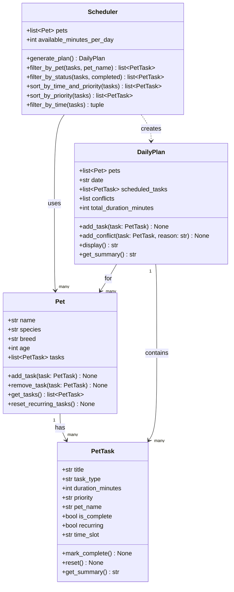

# PawPal+ — 4-Class Design Reference

## Final Class Set

### V1 Core (implement now)

| Class | Role |
|---|---|
| `Pet` | The entity being cared for; holds all its tasks |
| `PetTask` | A single care task with duration and priority (stored as plain strings) |
| `Scheduler` | Scheduling logic: sorts by priority, filters by time, produces a `DailyPlan` |
| `DailyPlan` | The output: ordered list of tasks that fit within the time budget |

### Deferred (add when scaling)

| Class | When to add |
|---|---|
| `Owner` | When supporting multiple owners. For now, `available_minutes_per_day` lives directly on `Scheduler`. |
| `Priority` (enum) | When you need strict validation. String `"low"/"medium"/"high"` + a sort dict is sufficient for v1. |
| `TaskType` (enum) | When you need to filter/validate by category. String `"walk"/"feed"/etc.` on `PetTask` is fine for v1. |

---

## UML Diagram

---

## Class Details

### `PetTask`
- `title`: human-readable name (e.g. `"Morning walk"`)
- `task_type`: plain string — `"walk"`, `"feed"`, `"medication"`, `"grooming"`, `"enrichment"`, `"other"`
- `duration_minutes`: how long the task takes
- `priority`: plain string — `"low"`, `"medium"`, or `"high"`
- `pet_name`: stamped automatically by `Pet.add_task()`; empty string until attached to a pet
- `is_complete`: `False` by default; set to `True` by `mark_complete()`
- `recurring`: if `True`, `reset()` clears `is_complete` so the task re-enters tomorrow's plan
- `time_slot`: `"morning"`, `"midday"`, `"evening"`, or `"anytime"`; inferred from `task_type` if left blank
- `mark_complete()`: marks the task done
- `reset()`: re-enables a recurring task for the next day
- `get_summary()`: one-line label including completion status, pet name, title, duration, priority, and slot

### `Pet`
- Holds the pet's basic info and owns a list of `PetTask` objects
- `add_task` / `remove_task` / `get_tasks` manage the task list
- `reset_recurring_tasks()`: calls `reset()` on every task to prepare for a new day's plan

### `Scheduler`
- Holds a **list of `Pet` objects** (supports multiple pets) and the daily time budget
- `generate_plan()` — main entry point; collects incomplete tasks from all pets, sorts, filters, and returns a `DailyPlan`
- `filter_by_pet(tasks, pet_name)` — returns only tasks belonging to the named pet
- `filter_by_status(tasks, completed)` — returns tasks matching the given completion state
- `sort_by_time_and_priority(tasks)` — sorts by slot (morning first), then descending priority, then task-type criticality
- `sort_by_priority(tasks)` — sorts by priority only (kept for backward compatibility)
- `filter_by_time(tasks)` — greedy scheduler; returns `(scheduled_tasks, [(conflict_task, reason), ...])` — tasks that bust the daily budget or a slot's capacity land in the conflicts list

### `DailyPlan`
- Holds the **list of `Pet` objects**, the date, scheduled tasks, conflicts, and running duration total
- `conflicts`: list of `(PetTask, reason_str)` tuples for tasks that couldn't be scheduled
- `add_task(task)` / `add_conflict(task, reason)` populate the plan after scheduling
- `display()` renders a slot-grouped human-readable schedule including any skipped tasks
- `get_summary()` returns a short one-liner (e.g. `"3 tasks, 60 min total, 1 conflict(s)"`)

---

## Implementation File
All 4 classes live in **`pawpal_system.py`** at the project root.
